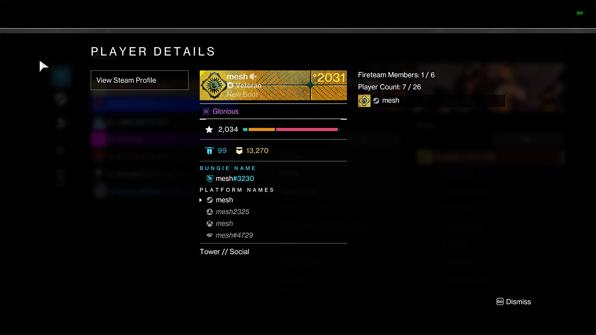

# lookup

lookup is a Python3 script that allows you to lookup Destiny 2 player details on [Destiny Trials Report](https://trials.report/) from within the game.

Simply click on the player name in game, take a screenshot, and Trials Report will be launched with that player's info.

If you run into any issues, have any ideas, or just want to chat, please post in [issues](https://github.com/mikechambers/lookup/issues) or share on [Discord](https://discord.gg/2Y8bV2Mq3p).

The script gives the choice of two image parsing engines, [Open CV](https://opencv.org/) (default) and the [Open AI API](https://platform.openai.com/).

## Requirements

This script requires that:

-   Python 3 is installed
-   You have a valid Destiny 2 Developer API Key. You can grab one from the [Bungie Developer Portal](https://www.bungie.net/en/User/API)
-   Your API key is stored in environment variables named DESTINY_API_KEY.

If you are using the OPEN CV engine (default):

-   Install [Tesseract](https://github.com/UB-Mannheim/tesseract/wiki)
-   Add Tesseract install directory to your Windows PATH environment variable.

If you are using the OPEN AI API:

-   You have a valid [Open AI API key](https://platform.openai.com/api-keys)
-   Your API keys is stored in environment variables named OPENAI_API_KEY.

## Usage

First, before running the script you must install the required libraries:

```
pip install -r requirements.txt
```

To start the script, simply call it, passing the directory where screenshots will be saved:

```
$python lookup.py --screenshot-dir "C:/Users/USERACCOUNT/Documents/Destiny 2/Screenshots/"
```

Then, within Destiny, open the player detail screen and take a screenshot.



The script will detect the screenshot, parse the bungie id, play a sound and then launch trials report with the player's info.

By default, the OPEN CV engine will be used. If you would like to use the OPEN AI engine, then you can specify it like so:

```
$python lookup.py --screenshot-dir "C:/Users/USERACCOUNT/Documents/Destiny 2/Screenshots/" --engine openai
```

## Known Issues

You may get a "Error retrieving member from Destiny API" message. This can happen if the bungie id is not extracted correctly from the screenshot (sometimes characters may be missing).

## License

Project released under a [MIT License](LICENSE.md).

[](LICENSE.md)
